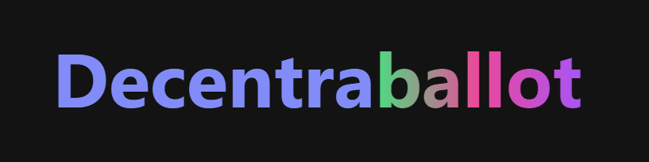

 

  

  <h3 align="center">Decentraballot</h3>

  

    Decentralized voting dapp using the Truffle Suite, Next, and Ethers
     
    <a href="https://github.com/zaidallam/Decentraballot"><strong>Explore the docs »</strong></a>
     
  

## About The Project

This is a concept DApp that allows users to create contests/elections, add authorized voters, and collect votes. Voting delegation is technically possible using the existing smart contract code, but this feature has not been implimented yet.
This is a two-page concept project that was built using several fameworks and libraries, including but not limited to the Truffle Suite, Ethers, Next, and Tailwind.
The project is meant to showcase how smart contracts may be used manage a voting system in a decentralized manner. This means that, as far as the UI goes, it is still missing some polishing such as loading animations, double-request protection, input validation, and other similar features. These features were deemed unnecessary for the purposes of this concept project. That said, the project still has an aesthetic but simple frontend.
This project and its code were engineered solely by Zaid Allam.

(<a href="#top">back to top</a>)

### Built With

* [Truffle Suite](https://github.com/trufflesuite)
* [Ethers](https://github.com/ethers-io/ethers.js/)
* [Next](https://github.com/vercel/next.js/)
* [Tailwind](https://github.com/tailwindlabs/tailwindcss)
* [Chart.js](https://github.com/chartjs)

(<a href="#top">back to top</a>)

## Prerequisites

This project requires you to have Node.js and npm installed on your system.

(<a href="#top">back to top</a>)

## License

Distributed under the MIT License. See `LICENSE` for more information.

(<a href="#top">back to top</a>)

## Contact

See the developer's portfolio, zaidallam.com, for contact info.

(<a href="#top">back to top</a>)

